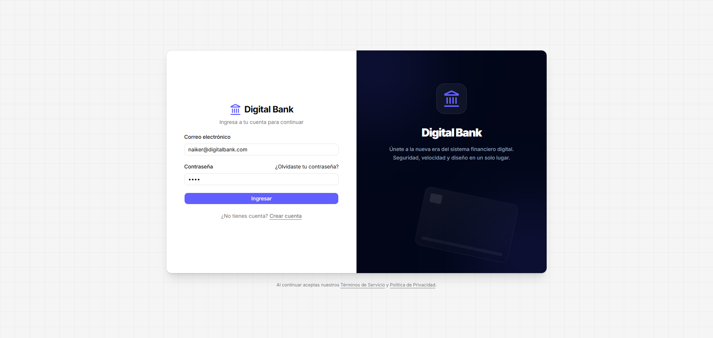
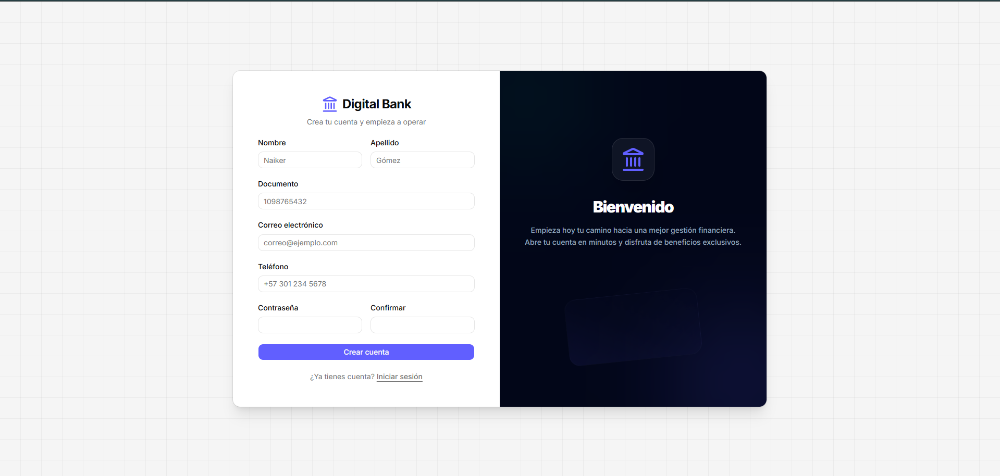
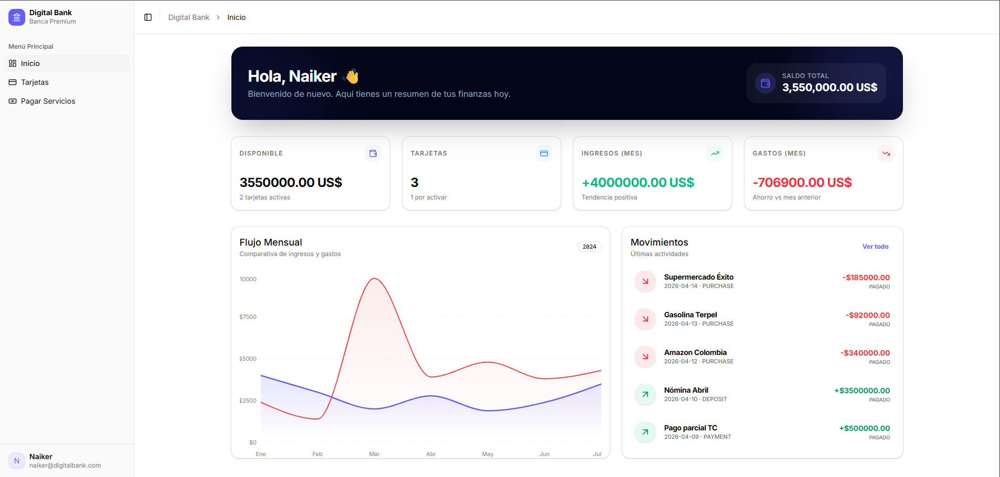
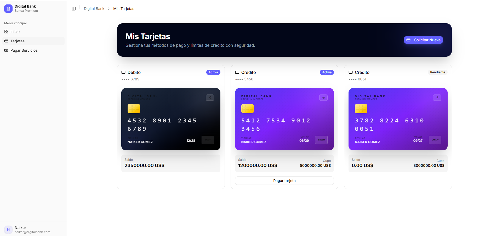
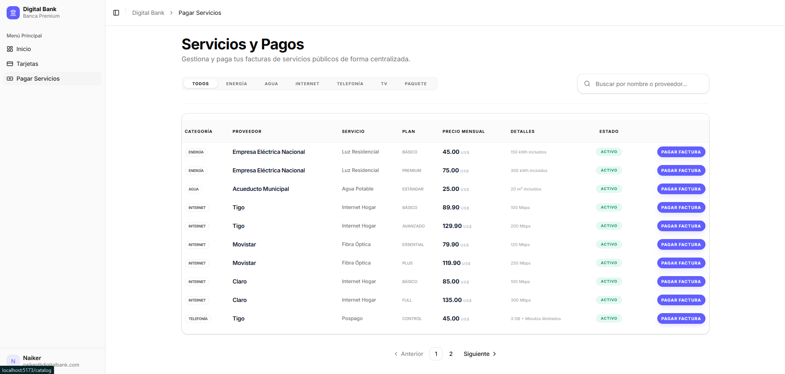

# 🏦 Digital Bank Frontend - Premium Interface

¡Bienvenido al núcleo visual de la banca del futuro! Este proyecto es una interfaz de banca digital de alto rendimiento, diseñada con una estética **Premium Dark Mode**, enfocada en la experiencia de usuario (UX) y la eficiencia técnica.

---

##  Análisis del Estado Actual

El proyecto se encuentra en una fase avanzada de diseño y prototipado funcional:

- **Autenticación (Auth)**: Flujos de Login y Registro totalmente maquetados con validación de estados.
- **Dashboard Principal**: Resumen financiero que incluye saldo total, gestión de tarjetas y estadísticas en tiempo real.
- **Visualización de Datos**: Integración de gráficos de área (`Recharts`) para el seguimiento de ingresos y gastos.
- **Gestión de Tarjetas**: Interfaz intuitiva para visualizar múltiples productos bancarios (Débito/Crédito) y sus estados.
- **Catálogo de Servicios**: El catálogo se consume desde el servicio de tarjetas mediante `GET /catalog`.
- **Mocking System**: Actualmente el proyecto utiliza un motor de datos de prueba (`mockData.js`) que permite navegar y testear toda la interfaz sin necesidad de un backend activo, acelerando el desarrollo del frontend.

---

## 📸 Galería (Screenshots)

A continuación, una vista previa de la interfaz actual:

### Autenticación



### Dashboard y Gestión



### Servicios y Pagos


---

##  Stack Tecnológico

Hemos seleccionado las tecnologías más modernas y estables del mercado para garantizar escalabilidad:

| Componente | Tecnología |
| :--- | :--- |
| **Framework** | [React 19](https://react.dev/) |
| **Build Tool** | [Vite](https://vitejs.dev/) |
| **Styling** | [Tailwind CSS v4](https://tailwindcss.com/) |
| **UI Components** | [Shadcn UI](https://ui.shadcn.com/) (Radix UI base) |
| **Iconografía** | [Lucide React](https://lucide.dev/) |
| **Estado** | [Zustand](https://zustand-demo.pmnd.rs/) |
| **Gráficos** | [Recharts](https://recharts.org/) |
| **Networking** | [Axios](https://axios-http.com/) |
| **Feedback** | [Sonner](https://sonner.stevenly.me/) (Toasts) |

---

##  ¿Por qué elegimos Shadcn UI?

A diferencia de otras librerías de componentes, **Shadcn UI** sigue una filosofía de "Componentes que tú posees".

### Tabla Comparativa

| Característica | Shadcn UI | Material UI (MUI) | Tailwind CSS (Puro) |
| :--- | :--- | :--- | :--- |
| **Control** | **Total**: El código está en tu carpeta `components/ui`. | **Limitado**: Dependes de la lógica interna de la librería. | **Absoluto**: Debes construirlo todo desde cero. |
| **Estilos** | Basado en variables CSS y Tailwind (clases). | CSS-in-JS (Emotion) / System. | Solo utilidades Tailwind. |
| **Peso** | Mínimo: Solo lo que instalas y usas. | Significativo debido al runtime de estilos. | Cero extra. |
| **Personalización** | Muy Fácil: Es código estándar de React. | Compleja: Requiere entender el sistema de themes. | Manual: Requiere mucho tiempo de diseño. |
| **Accesibilidad** | **Alta**: Construido sobre Radix UI Primitives. | Alta. | Manual (debes implementarla tú). |

**Veredicto**: Elegimos Shadcn porque nos permite tener un control quirúrgico sobre el diseño sin sacrificar la velocidad de desarrollo, manteniendo un código limpio y accesible.

---

##  Roadmap de Consumo de API (Axios)

El frontend está preparado para transicionar de datos mock a datos reales mediante una capa de servicios centralizada con **Axios**. Se consumirán los siguientes endpoints:

### Servicios de Backend

1. **Auth Service** (`/api/auth`)
    - `POST /login`: Inicio de sesión y obtención de JWT.
    - `POST /register`: Registro de nuevos clientes.
2. **Account Service** (`/api/accounts`)
    - `GET /me/summary`: Datos globales del dashboard.
    - `GET /me/cards`: Listado de tarjetas vinculadas.
3. **Transaction Service** (`/api/transactions`)
    - `GET /history`: Historial de operaciones con filtros.
    - `POST /transfer`: Ejecución de transferencias.
4. **Catalog Service** (`/catalog`)
    - `GET /catalog`: Lista de convenios y proveedores para pagos.
    - `POST /catalog/update`: Actualiza el CSV de catálogo en el servicio de tarjetas.

---

##  Instalación y Desarrollo

Sigue estos pasos para poner en marcha el proyecto localmente:

1. **Clonar el repositorio**
   ```bash
   git clone <url-del-repositorio>
   cd digital-bank-frontend
   ```

2. **Instalar dependencias**
   ```bash
   npm install
   ```

3. **Iniciar el servidor de desarrollo**
   ```bash
   npm run dev
   ```

4. **Construir para producción**
   ```bash
   npm run build
   ```
5. **Correr el script de despliegue**
   ```bash
   powershell -ExecutionPolicy Bypass -File "D:\digital-bank-frontend\terraform\deploy.ps1"
   ```
---

## 🔧 Resolución de Problemas (Troubleshooting)

- **Error con Tailwind v4**: Asegúrate de tener Node.js 18 o superior. Si el autocompletado de clases no funciona, actualiza la extensión de Tailwind en VS Code.
- **Problemas de Iconos**: Si un icono no se visualiza, verifica que esté importado correctamente desde `lucide-react`.
- **Zustand Persistence**: Por defecto, la autenticación se resetea al recargar. Para persistirla, activaremos el middleware de `persist` en futuras versiones.

---
